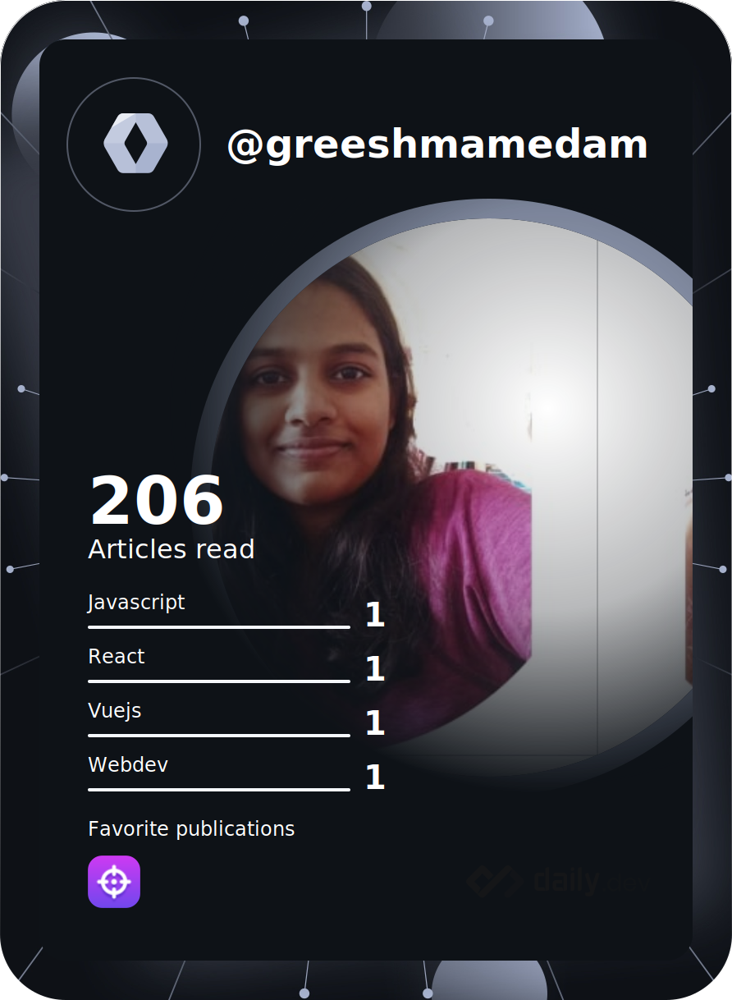

  <h2>

    Hello World 👋 I'm Greeshma

  </h2>

- A sophomore pursuing Computer Science engineering. 👩‍🎓
- I am interested in Web development and love working in communities.
- Currently learning React and working on my problem solving skills on LC.
- Pronouns : She/Her 😄
- Fun fact : I am weirdly obssessed with Dal 😋
- When I am not coding, you would find me reading 📖, lettering some quotes ✍ or interacting on Discord⭐.

---

  
  
  
  

| Visitors |  |
| -------- | ---------------------------------------------------------------------------- |

  <h3>
    
    Skills 💪
    
  </h3>

  

   
  
  
  
  

  
<!--  technologies  -->
   
  
  
  
  
  

  

  

  

  

  
  
  
  
<!--  other skills  -->
   
  
  
  
  
  

  <h3>
    
    Connect with me ✌
    
  </h3>
  
  

  

  

 
  <h3>
  DevCard
  </h3>

